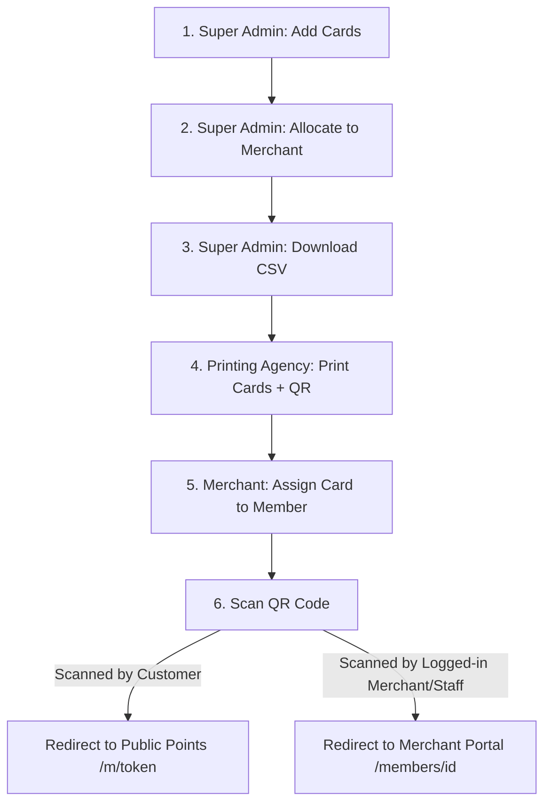

# Metro Cardz — Physical Cards & QR Redirection Guide

This guide explains how the physical card lifecycle, printing, allocation, and scan-redirection flow works step-by-step.

---

## The Workflow Overview

---

## Step-by-Step Instructions

### Step 1: Super Admin Adds Cards to Global Inventory
1. Log in to the portal as the **Super Admin**.
2. Navigate to the **Card Inventory** page.
3. Click **Add / Generate Cards**.
4. Choose either:
   * **Paste**: Enter a list of raw 16-digit card numbers manually.
   * **Generate**: Input a Prefix (e.g. `4821 6739 00`), a Starting Number, and Count (e.g. `50`), and let the system generate them.
5. Click **Add Cards** to save them to the global pool.

### Step 2: Super Admin Allocates Cards to a Merchant
1. On the **Card Inventory** page, click **Allocate to Merchant**.
2. Select the target **Merchant** from the dropdown.
3. Enter the quantity of cards to allocate (e.g., `50`).
4. Click **Allocate Cards**. The system automatically pulls `50` unallocated cards from the pool and assigns them to the merchant.

### Step 3: Super Admin Downloads CSV for Printing
1. Filter the card table by selecting the **Merchant** in the filter dropdown.
2. Click **Download CSV**.
3. A file named `cards_export.csv` will download containing:
   * **Card Number**: Formatted number (e.g., `4821 6739 0000 0001`).
   * **Raw Number**: Continuous digits (e.g., `4821673900000001`).
   * **Redirect Link**: The redirect URL containing the raw card number parameter: `https://metrocardz.in/c/?n=4821673900000001`.

### Step 4: Printing the Physical PVC Cards
1. Send the downloaded `cards_export.csv` file to your PVC card printing agency.
2. Instruct the agency to:
   * Print the formatted **Card Number** on the front/back of the physical card.
   * Generate a **QR Code** containing the corresponding **Redirect Link** and print it on the card.

---

## Step 5: Merchant / Employee Assigns Card to Member

Once the merchant receives the physical cards, they can assign them to members in two ways:

### Option A: During New Member Enrollment (Registering)
1. In the merchant portal, go to **Members** and click **Add Member**.
2. Fill out the member's details (Name, Phone, Email, etc.).
3. Under the **Physical Card** dropdown, select one of the merchant's allocated card numbers.
4. Click **Add Member**. The card is linked instantly.

### Option B: Assign to an Existing Member
1. Go to **Cards** inside the merchant portal.
2. Find any card in your pool showing the status `Available` (`merchant_allocated`).
3. Click **Link to Member**.
4. Search for the member by name/phone and select them.
5. Click **Assign**. The card is now linked to their profile.
*(Note: If a member gets a new card, you can click **Unlink Card** to return the old card to the pool and link a new one).*

---

## Step 6: Scanning the Card (How Redirection Works)

When a customer or staff scans the printed QR code using a smartphone camera, the link `https://metrocardz.in/c/?n=4821673900000001` opens in their browser:

### Scenario A: Scanned by the Customer (Public View)
* **Redirection**: The browser detects no active merchant session. It queries the backend and redirects the customer to their public Points & Rewards page:
  `https://metrocardz.in/m/customer_public_token`
* **Features**: The customer views their real-time points, active reward vouchers, and can add their pass to **Google Wallet**.

### Scenario B: Scanned by Logged-in Merchant Staff
* **Redirection**: The browser detects that a merchant owner/staff is logged in on this phone. It queries the backend and redirects them directly to the member's profile page inside the portal:
  `https://metrocardz.in/members/member_id/`
* **Features**: The employee can instantly add points, scan/redeem coupons, and manage the customer's account without searching for them.

### Scenario C: Scanned Card is Not Activated Yet
* If the card hasn't been assigned to anyone, the page shows a beautiful **"Card Not Activated"** screen:
  * **Customer view**: Suggests handing the card to a store executive to activate it.
  * **Merchant view (if logged in)**: Shows a **"Register Member with Card"** button to register a new member on the spot and link the card.
